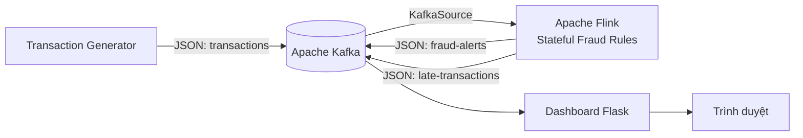

# FraudScope — phát hiện gian lận tài chính theo thời gian thực

FraudScope là một phần mềm mô phỏng luồng giao dịch tài chính và phát hiện hành vi đáng ngờ theo thời gian thực. Toàn bộ hệ thống chạy bằng Docker Compose, không yêu cầu cài Java, Maven, Kafka hay Flink trên máy host.

## Kiến trúc



- **Generator** tạo giao dịch bình thường và lần lượt cài xen các kịch bản gian lận cùng dữ liệu đến muộn.
- **Kafka** lưu topic `transactions`, `fraud-alerts` và `late-transactions`, chạy KRaft không cần ZooKeeper.
- **Flink** phân vùng theo `accountId`, lưu state và chấm điểm từng giao dịch.
- **Dashboard** đọc các topic Kafka và hiển thị giao dịch, cảnh báo, mức độ rủi ro theo thời gian thực.

Dashboard còn gửi lệnh điều khiển qua topic `generator-control`; generator phản hồi trạng thái qua `generator-status`. Vì vậy dashboard không cần quyền truy cập Docker socket.

## Chạy nhanh

Yêu cầu duy nhất: Docker Desktop (hoặc Docker Engine) cùng Docker Compose.

```bash
docker compose up --build -d
```

Lần chạy đầu Docker sẽ tải image và Maven dependencies nên có thể mất vài phút. Kiểm tra trạng thái:

```bash
docker compose ps
docker compose logs -f generator jobmanager taskmanager dashboard
```

Sau khi các container hoạt động:

- Dashboard: <http://localhost:8080>
- Flink Web UI: <http://localhost:8081>
- Kafka từ máy host: `localhost:9092`

## Điều tra cảnh báo và điều khiển mô phỏng

- Bấm một dòng trong **Cảnh báo mới nhất** để mở hồ sơ điều tra.
- Hồ sơ hiển thị điểm rủi ro, luật đã kích hoạt, thiết bị, quốc gia và 12 giao dịch gần nhất của tài khoản.
- Có thể cập nhật trạng thái, người xử lý và ghi chú. Dữ liệu này được lưu trong SQLite trên volume `dashboard-data` nên vẫn còn sau khi tạo lại container dashboard.
- Khối **Simulation Lab** cho phép tạm dừng/tiếp tục generator, thay đổi TPS và phát ngay các kịch bản gian lận hoặc dữ liệu đến muộn.
- Dải **Streaming semantics** hiển thị cấu hình Exactly-once, checkpoint, watermark và số sự kiện đã bị phân loại quá hạn.
- Khối **Event Explorer** cho phép tìm mã giao dịch/tài khoản; lọc theo mức độ, quốc gia, kịch bản và thời gian; sắp xếp theo thời gian, số tiền hoặc điểm rủi ro; sau đó xuất đúng tập kết quả ra CSV/JSON.
- Nút **Critical · 15 phút** áp dụng nhanh bộ lọc cảnh báo nghiêm trọng trong 15 phút gần nhất.

Các lệnh điều khiển đi qua Kafka, ví dụ:

```bash
curl -X POST http://localhost:8080/api/generator/control \
  -H "Content-Type: application/json" \
  -d '{"command":"configure","tps":8}'

curl -X POST http://localhost:8080/api/generator/control \
  -H "Content-Type: application/json" \
  -d '{"command":"inject","scenario":"IMPOSSIBLE_TRAVEL"}'

curl -X POST http://localhost:8080/api/generator/control \
  -H "Content-Type: application/json" \
  -d '{"command":"inject","scenario":"OUT_OF_ORDER"}'

curl "http://localhost:8080/api/events?severity=HIGH&minutes=60&sort=risk&order=desc"

curl -OJ "http://localhost:8080/api/events/export?format=csv&scenario=RAPID_FIRE"
```

Dừng hệ thống:

```bash
docker compose down
```

Xóa container và các tài nguyên tạm để chạy lại từ đầu:

```bash
docker compose down -v --remove-orphans
```

## Các luật phát hiện

| Tín hiệu | Mặc định | Điểm rủi ro |
|---|---:|---:|
| Số tiền giao dịch lớn | từ 100.000.000 VND | +60 |
| Tần suất bất thường | từ 5 giao dịch / 10 giây / tài khoản | +55 |
| Đổi quốc gia quá nhanh | trong vòng 120 giây | +70 |
| Đổi thiết bị quá nhanh | trong vòng 120 giây | +15 |

Một cảnh báo được phát khi tổng điểm từ 50 trở lên. Mức độ là `MEDIUM` (50–69), `HIGH` (70–99) hoặc `CRITICAL` (từ 100). Nhãn `scenario` do generator tạo chỉ dùng để quan sát trên dashboard; Flink không dùng nhãn này khi phát hiện.

Các kịch bản mô phỏng:

1. `HIGH_AMOUNT`: giao dịch 120–350 triệu VND.
2. `RAPID_FIRE`: sáu giao dịch liên tiếp trên cùng tài khoản.
3. `COUNTRY_HOP`: đổi quốc gia trong 250 ms nhưng giữ nguyên thiết bị và số tiền bình thường, tạo cảnh báo `HIGH`.
4. `IMPOSSIBLE_TRAVEL`: cùng tài khoản chuyển số tiền lớn từ Việt Nam sang Mỹ sau 250 ms và đổi thiết bị; giao dịch thứ hai kết hợp nhiều tín hiệu để tạo cảnh báo `CRITICAL`.
5. `OUT_OF_ORDER`: phát một giao dịch có event time chậm 30 giây. Khi watermark đã tiến lên, Flink chuyển sự kiện sang topic `late-transactions` thay vì đưa vào luật gian lận.

Luồng bình thường dùng 500 tài khoản mô phỏng để khi tăng TPS, tải toàn hệ thống không vô tình biến thành hành vi rapid-fire trên một nhóm tài khoản quá nhỏ. Biểu đồ phân bố mức độ và tín hiệu thường gặp cho phép chọn cửa sổ 60 giây, 5 phút, 15 phút, 1 giờ, 6 giờ, 24 giờ hoặc toàn bộ dữ liệu; lựa chọn được ghi nhớ trên trình duyệt.

## Chịu lỗi, checkpoint, savepoint và watermark

- Job dùng `CheckpointingMode.EXACTLY_ONCE`; hai Kafka sink dùng transaction với transactional ID riêng.
- Dashboard dùng `isolation.level=read_committed`, vì vậy chỉ đọc cảnh báo và late event sau khi transaction của checkpoint được commit.
- Checkpoint chạy mỗi 10 giây, tối đa một checkpoint đồng thời và được giữ lại khi job bị hủy.
- Checkpoint/savepoint nằm trên named volume `flink-state`; dữ liệu Kafka nằm trên `kafka-data`.
- Watermark cho phép dữ liệu lệch thứ tự tối đa 5 giây và đánh dấu partition idle sau 15 giây.
- Event cũ hơn watermark được ghi sang `late-transactions`; metric Flink tương ứng là `late_events`. Event lệch thứ tự nhưng vẫn trong watermark được tính bởi `out_of_order_events` và tiếp tục xử lý.
- Event-time timer tự dọn state cũ sau cửa sổ luật dài nhất.

Lấy Job ID tại <http://localhost:8081> hoặc bằng REST API, sau đó tạo savepoint:

```bash
make savepoint JOB_ID=<JOB_ID>
```

Lệnh tương đương:

```bash
docker compose exec jobmanager /opt/flink/bin/flink savepoint \
  <JOB_ID> file:///flink-data/savepoints
```

Để kiểm tra late-event flow, bấm **Out of order** trên dashboard. Vì Kafka sink là Exactly-once, bộ đếm có thể cập nhật sau checkpoint kế tiếp, tức tối đa khoảng 10 giây với cấu hình mặc định.

## Tùy chỉnh

Sao chép `.env.example` thành `.env`, sau đó sửa các giá trị:

```dotenv
TRANSACTIONS_PER_SECOND=4
FRAUD_INTERVAL_SECONDS=8
HIGH_AMOUNT_THRESHOLD=100000000
RAPID_TRANSACTION_COUNT=5
RAPID_WINDOW_SECONDS=10
COUNTRY_CHANGE_WINDOW_SECONDS=120
```

Sau khi đổi luật, tạo lại container Flink:

```bash
docker compose up --build -d --force-recreate jobmanager taskmanager generator
```

## Kiểm thử

Unit test kiểm tra từng luật và tính ổn định của `alertId` được chạy ngay trong bước build Flink. Có thể chạy riêng:

```bash
docker build --target test -t fraud-detection-flink-test ./flink-job
```

Kiểm tra dữ liệu trực tiếp trong Kafka:

```bash
docker compose exec kafka /opt/kafka/bin/kafka-console-consumer.sh \
  --bootstrap-server kafka:19092 --topic fraud-alerts --from-beginning
```

API snapshot của dashboard:

```bash
curl http://localhost:8080/api/snapshot
```

## Lưu ý khi đưa lên production

Đây là demo kỹ thuật. Môi trường thật nên dùng Kafka nhiều broker, Flink high availability và checkpoint trên object storage; bổ sung Schema Registry, xác thực/mã hóa, idempotent alert store, DLQ cho JSON lỗi, quan sát metrics, và mô hình/rule đã được kiểm định trên dữ liệu thực tế.
